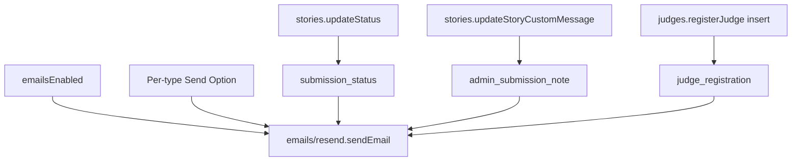

# Three transactional emails

Ship the three gaps from the last review. Do not add vote, comment, follow, mention, DM, Luma, or profile emails. Mentions and DMs stay on the daily digest.

## PRD first

Write [prds/transactional-status-judge-note-emails.md](prds/transactional-status-judge-note-emails.md) before code (this repo uses `prds/`, not `prds/`). Status starts In Progress. Cover problem, triggers, defaults off, edge cases, verification.

## Registry (one source of truth)

Add three types to [convex/emails/emailTypes.ts](convex/emails/emailTypes.ts) `EMAIL_TYPES`, `emailTypeValidator`, and `EMAIL_TYPE_DEFAULTS` (all `false`, same as submission and judging types):

- `submission_status` — approved or rejected
- `judge_registration` — first judge insert with an email
- `admin_submission_note` — moderator custom message

Point [convex/schema.ts](convex/schema.ts) `emailLogs.emailType` at `emailTypeValidator` instead of copying the union again. Switch [convex/emails/queries.ts](convex/emails/queries.ts) `hasReceivedEmailToday` to `emailTypeValidator` (it is currently a stale shorter union).

## Templates and senders

Follow the shell, footer, and unsubscribe pattern in [convex/emails/submissions.ts](convex/emails/submissions.ts). Reuse `getSubmissionEmailContext` (account email, then form email).

**1. Submission status** in `submissions.ts`

- `sendSubmissionStatusEmail({ storyId, status })`
- Only when status _changes_ to `approved` or `rejected` (not pending, not a no-op)
- Approved: live app URL
- Rejected: include `rejectionReason` when present
- Schedule from [convex/stories.ts](convex/stories.ts) `updateStatus` after the patch

**2. Admin note** in `submissions.ts`

- `sendAdminSubmissionNoteEmail({ storyId })`
- Only when `customMessage` is non-empty (not on clear)
- Body is the note plus the app URL
- Schedule from `updateStoryCustomMessage` next to the existing in-app `admin_message` alert

**3. Judge registration** in a small new file `convex/emails/judgeRegistration.ts`

There is no organizer “invite judge” mutation. [convex/judges.ts](convex/judges.ts) `registerJudge` is self-join; session lives in `localStorage` only.

- Send once, only on _new insert_, only if `email` is present
- Skip returning judges (existing name or userId)
- Do not put `sessionId` in the email
- Link: `https://vibeapps.dev/judging/{slug}` plus group name
- Schedule from `registerJudge` after insert

## Admin Email Send Options

Add rows in [src/components/admin/EmailManagement.tsx](src/components/admin/EmailManagement.tsx) `EMAIL_TYPE_GROUPS`:

- Submissions: `submission_status` — “Tells the submitter when their app is approved or rejected”
- Judging: `judge_registration` — “Receipt when someone first joins a judging group with an email”
- Admin: `admin_submission_note` — “Emails the submitter when a moderator leaves a note on their app”

No new UI besides those toggles. Master switch still wins.

## Docs after verify

Update [TASK.MD](TASK.MD), [changelog.md](changelog.md) (date from `git log --date=short -n 10`), [files.md](files.md). Mark the PRD Done.

## Out of scope

- Wiring dead `message_notification` / `mention_notification` immediate sends
- Magic judging session links
- Sample sends in `sendEmails.ts` unless needed to compile
- Changing existing template copy

## Verify

- `npx tsc -p convex/tsconfig.json` exit 0
- Email Send Options shows the three new rows, default off, disabled when the master switch is off
- `updateStatus` to approved/rejected schedules mail; same-status and pending do not
- Custom message schedules mail; clearing it does not
- First judge insert with email schedules mail; re-join does not
